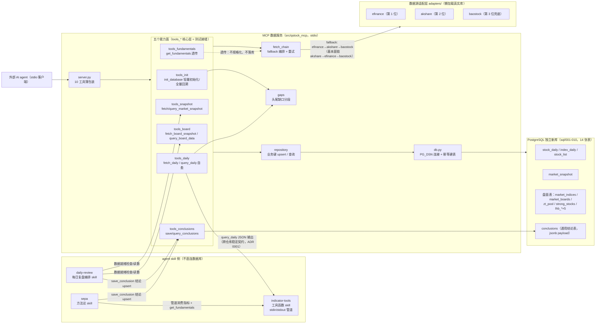

# 项目知识图谱

面向人类与 AI agent 的 5 分钟全图认知。术语遵循 `CONTEXT.md`（抓取/落库/透传/自愈/回溯/五个能力面）。
每条论断尽量标注来源（`path:line`）。设计决策的"为什么"在 `docs/adr/0001-0004`，本图只讲"是什么、在哪、和谁相连"。

## 总览图

## 实体清单

### MCP server 入口与公共层

- **`server.py`**：stdio MCP server，10 个工具只做薄包装，核心逻辑全在 `tools_*` 模块（`src/qstock_mcp/server.py:1-5`）；数据库连接按工具调用建立，启动不依赖 PG 可达（`server.py:4`）。入口 `qstock-mcp = qstock_mcp.server:main`（`pyproject.toml:17`）。
- **`output.py`**：统一错误输出契约——`status:"error"` + 工具名 + 参数回显 + 原因，工具层不抛异常（`output.py:4-6`、`db.py:31-41`）。
- **`dates.py`**：日期统一 `yyyymmdd`（接受 `yyyy-mm-dd`）；`days` 按交易日≈自然日 7/5 加 buffer 换算区间，宁多抓不少抓（`dates.py:14-50`）。
- **`db.py`**：连接串只从 `PG_DSN` 环境变量读（ADR 0002）；`ensure_schema` 幂等执行 `sql/*.sql` 全部 DDL（`db.py:21-28`、`db.py:44-54`）。

### 五个能力面（核心层 = 第一测试接缝，测试注入 fake 适配器 + 真实 PG 测试库）

- **init — `tools_init.py`**：轻量初始化 = 幂等建表 + 股票清单 + 全市场快照 + 7 个主要指数全历史日线，三部分独立成败，输出 `parts`/`failed_parts`，仅全败才整体 `error`（`tools_init.py:1-9`、`tools_init.py:34-42`、ADR 0004）。`backfill_history=True` 显式开启全量回溯：以 `stock_list` 为标的来源、固定 qfq、复用日线头尾自愈、单股失败不中断（`tools_init.py:110-158`）。
- **fetch/query 日线 — `tools_daily.py`**：`ensure_coverage` 只补请求区间头尾缺口（中段缺口视为停牌），是全量回溯与查询自愈共用的公共能力（`tools_daily.py:24-48`）；`fetch_daily` 与 `query_daily` 共用 `_run` 骨架（参数解析→连接→自愈），前者报告 upsert 行数，后者返回完整区间行（`tools_daily.py:67-147`）。
- **fetch/query 快照 — `tools_snapshot.py`**：全市场快照单次调用约 5000+ 只；交易日优先级：API 报告 > 传入参数 > 当天（`tools_snapshot.py:51-56`）。
- **fetch/query 盘面 — `tools_board.py`**：五 section（indices/boards/zt_pool/strong_stocks/lhb）独立 fallback、独立成败，仅全部失败才整体 `error`；盘中 lhb 空数据返回 `rows:0 + note`（盘后发布，非失败）；lhb 子项部分失败落已得数据并报 `partial_error`（`tools_board.py:30-32`、`tools_board.py:88-122`）。
- **proxy — `tools_fundamentals.py`**：基本面透传，`{section: 原始记录}` 键名保留上游、仅 JSON 安全化，不规格化、不连数据库、不落库；全失败 `status:"error"` 绝不伪造（`tools_fundamentals.py:1-8`）。
- **conclusions — `tools_conclusions.py`**：结论读写。写入校验日期与 payload 可 JSON 序列化；同业务键重复写为 upsert，`outcome` 报告 `inserted/updated`（`tools_conclusions.py:21-59`、ADR 0003）。

### 编排与落库

- **`fetch_chain.py`**：fallback 编排核心。每源最多重试 2 次（3 次尝试）；空结果视为成功（停牌/无交易日）不触发 fallback；全失败抛 `AllSourcesFailed` 携带 `attempted_sources`（每源尝试次数与错误）（`fetch_chain.py:22-52`）。只依赖适配器协议，不感知具体第三方库（`fetch_chain.py:1-9`）。
- **`gaps.py`**：头尾缺口规则——库内已有日期集合的最早/最晚之外才补抓，最多两段（`gaps.py:10-21`）。
- **`repository.py`**：全部 upsert 按业务键幂等。`stock_daily` 键 `(stock_code, trade_date, adj)`、`market_snapshot` 键 `(trade_date, stock_code)`（`repository.py:26-36`、`repository.py:87-98`）；盘面表注册表 `BOARD_SECTION_TABLES`（section→表/日期列/业务键/列集）与 `BOARD_QUERY_TABLES`（可查询表白名单，表名列名只来自内部常量，不接外部输入）（`repository.py:236-251`、`repository.py:292-304`）；结论 upsert 用 CTE 预查业务键判定 inserted/updated（`repository.py:344-376`）。盘面表无 `source` 列（本项目 DDL 决策，`repository.py:233-235`）。

### 数据源适配层

- **`adapters/base.py`**：协议接缝。六个 Protocol（Daily/Snapshot/Board/Fundamentals/List/IndexDaily）合成 `DataAdapter`；失败一律抛 `FetchError`，返回空列表不是错误（`base.py:174-260`）。`BAR_FIELDS` 等列集是行 dict 与落库列的共同词汇（`base.py:20-171`）。北交所代码（4/8/9 开头）`is_bse_code` 明确拒绝（`base.py:263-265`）；`json_safe` 做透传序列化（NaN/numpy/日期→JSON 安全值，不改键名）（`base.py:268-294`）。
- **三个真实适配器**：懒加载第三方库，未安装报明确 `FetchError`（`pyproject.toml:13-14`）。日线/快照/清单链顺序 efinance→akshare→baostock（`adapters/__init__.py:38-44`）；基本面链按数据丰富度排序 akshare→efinance→baostock（`adapters/__init__.py:47-57`）。能力差异：efinance 盘面仅支持 indices 且无干净指数历史接口；akshare 五 section 全支持（东财接口）；baostock 无全市场快照、无振幅/换手列（置 null 不伪造）（`efinance_adapter.py:1-2`、`akshare_adapter.py:1-5`、`baostock_adapter.py:1-7`）。
- **`_eastmoney.py` / `_board_em.py`**：东财中文列→落库行 dict 的纯函数映射，不 import 第三方库，测试无需触网；`-`/空/nan 统一映射为 None（`_eastmoney.py:1-6`、`_board_em.py:1-8`）。

### PostgreSQL 表（`sql/001-010`，独立新库，ADR 0002）

- 日线类：`stock_daily`（带 `adj` 与 `source` 列）、`index_daily`（指数与个股分表——`000001` 代码冲突，指数无复权）、`stock_list`（主键 `stock_code`，全量回溯标的来源）（`sql/001`、`sql/010`、`sql/009`、ADR 0004）。
- 快照类：`market_snapshot`（`sql/002`）。
- 盘面类：`market_indices`/`market_boards`/`zt_pool`/`strong_stocks` + lhb 五表（`lhb_basic`/`lhb_stock_detail`/`lhb_stock_statistic`/`lhb_yyb_capital`/`lhb_yyb_most`；`lhb_stock_detail` 无业务唯一键，仅随父表存在）（`sql/003-007`、`repository.py:292-293`）。
- `conclusions`：业务唯一键 `(subject_type, subject_code, trade_date, conclusion_type)` 在 schema 层钉死，`payload` 为 jsonb、结构由写入方 skill 自报、server 不校验（`sql/008_conclusions.sql:3-17`、ADR 0003）。

### agent skill（`skills/`，第二测试接缝：脚本 stdin/stdout）

- **indicator-tools（工具函数 skill）**：`scripts/indicators.py` 纯标准库，stdin 吃 `query_daily` 输出 JSON、stdout 吐指标 JSON，不访问数据库、现算现用不物化（ADR 0001）。指标目录：MA/MACD/BOLL/RSI/diff1/diff2/rolling_max/rolling_min/maxdd/chg，边界规则（null 头部）随输出 `boundary_rule` 回显。退出码 0=ok/insufficient_data（数据不足非错误）、1=输入错误、2=参数错误（`skills/indicator-tools/SKILL.md:20-49`）。测试在 `skills/indicator-tools/tests/`。
- **sepa（方法论 skill）**：判断逻辑为主体，无脚本。取数链路：`query_daily(days=400)` → 管道给 indicator-tools；`get_fundamentals` 取基本面；指数基线不可经 MCP 获得时用 `query_board_data("market_indices")` 快照降级并标注。`count<250` 或数据缺失即报告缺口、不硬算、不编造。结论可经 `save_conclusion(..., conclusion_type="sepa.full")` 落库（`skills/sepa/SKILL.md:8-26`、`skills/sepa/SKILL.md:82`）。
- **daily-review（每日复盘编排 skill）**：轻脚本重编排，agent 手写结论 JSON 与 markdown 报告。流程：就绪检查（核心表缺则先补抓）→ 读数 → 报告落盘 `skills/daily-review/reports/` → `save_conclusion(subject_type="market", subject_code="_market", conclusion_type="daily_review.<mode>")`（payload 必含 `report_path`）→ 落库失败即中止，不算复盘完成（`skills/daily-review/SKILL.md:17-30`）。

### 测试与协作

- **`tests/`**：`conftest.py` 的 `pg_test` fixture 连真实 PG 测试库 `qstock_test`（不可达自动 skip，`QSTOCK_TEST_PG_DSN`/`QSTOCK_TEST_MAINT_DSN` 可覆盖）（`tests/conftest.py:1-47`）；`fakes.py` 的 fake 适配器与真实适配器实现同一协议。测试直接打 `tools_*` 核心层，不经 MCP 协议层。
- **协作面**：issue 走 GitHub Issues（`gh` CLI），triage 标签与 domain docs 消费约定见 `docs/agents/`（`AGENTS.md:1-13`）。`.agents/skills/` 下的协作 skill（来自 `skills-lock.json`）仅服务本仓库开发流程，不属于交付物。

## 关键流程

- **查询自愈（头尾缺口）**：`query_daily`/`fetch_daily` → `resolve_range` 解析区间 → `select_dates` 取库内已有日期 → `head_tail_gaps` 算头尾分段（最多两段，中段缺口=停牌）→ 逐段 `fetch_with_fallback` → `upsert_daily` → `select_daily` 返回完整区间，自愈分段在输出 `healed`/`segments` 中报告（`tools_daily.py:67-99`、`gaps.py:10-21`）。
- **fallback 与重试**：每种抓取（日线/快照/五 section/基本面/清单/指数日线）各有一个 `fetch_*_with_fallback`，共享同一 `_with_fallback` 内核：按链顺序尝试、每源 3 次尝试、空结果即成功、全失败抛 `AllSourcesFailed`（`fetch_chain.py:34-167`）。
- **section 级独立成败**：`fetch_board_snapshot` 与 `init_database` 同构——逐项独立 fallback、逐项成败进 `sections`/`parts`，仅全部失败才整体 `error`（`tools_board.py:108-122`、`tools_init.py:185-212`）。重试方式就是再调一次（幂等，ADR 0004）。
- **结论 upsert**：业务键在 schema 层钉死；CTE 预查判定 `inserted/updated`；payload 不校验，结论类型（`daily_review.close`、`sepa.full` 等）的字段约定由各 skill 文档承载（ADR 0003）。
- **skill 间数据流**：`query_daily` JSON（跨仓库稳定契约，ADR 0001）→ indicator-tools stdin → 指标 JSON → 方法论 skill（sepa）判断 → `save_conclusion`；daily-review 不经 indicator-tools，直接读盘面/快照表后编排落库。

## 入口指引（想改 X 先看哪里）

- **改表结构/schema**：`sql/00X_*.sql`（DDL 拥有权在本项目）→ `repository.py`（列集/业务键/注册表）→ `adapters/base.py` 的 `*_FIELDS` → 相关 ADR（0002 选型、0003 结论表、0004 init 表）。改完跑 `tests/test_repository.py` + 对应 fetch/query 测试。
- **改 `query_daily` 输出结构**：这是跨仓库稳定契约（ADR 0001）——`tools_daily.py` + `skills/indicator-tools/SKILL.md` 输入契约 + `skills/indicator-tools/tests/` 必须同步，变更需谨慎。
- **加数据源**：实现 `adapters/base.py` 的协议 → 新建 `adapters/<name>_adapter.py` → 调整 `adapters/__init__.py` 两条链的顺序 → `tests/fakes.py`/`test_adapters.py` 覆盖。
- **加盘面 section/表**：`sql/` 新 DDL → `repository.BOARD_SECTION_TABLES`/`BOARD_QUERY_TABLES` → `BoardAdapter` 协议与 `_board_em.py` 映射 → `tools_board.ALL_SECTIONS`。
- **加指标**：只动 `skills/indicator-tools/scripts/indicators.py` 与其测试，不改 MCP server（ADR 0001）；新增指标不得改变既有契约（`skills/indicator-tools/SKILL.md:95`）。
- **加结论类型**：零 schema 变更（ADR 0003），只在对应 skill 文档约定 payload 字段并调用 `save_conclusion`。
- **加 MCP 工具**：核心逻辑进 `tools_<面>.py`（可注入适配器、返回自描述 dict），`server.py` 只加薄包装；测试打核心层。
- **改 fallback/重试策略**：`fetch_chain.py`（注意"最多 3 次"按尝试次数口径，`fetch_chain.py:122-124`）+ `tests/test_fetch_chain.py`。
